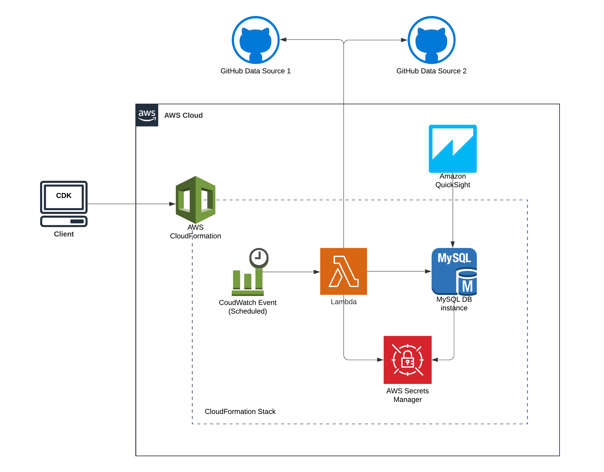

Git Repo for the A Cloud Guru Extract Transform Load (ETL) Challenge - https://acloudguru.com/blog/engineering/cloudguruchallenge-python-aws-etl

#################################

- Uses AWS CDK as the Infrastucture as Code Tool
- Uses Lambda to host the Python ETL Code
- Pandas used for data ETL functions
- MySQL RDS used for Data Persitance Layer
- RDS Secrets stored in AWS Secrets Manager 
- CloudWatch events used to trigger Lambda 
- AWS QuickSight used to visualise the data

High Level Architecture Diagram:

